# 🏏 IPL 2024 Dataset – Data Cleaning & Visual Analytics
---

## 📘 Overview

This project focuses on cleaning, analyzing, and visualizing match-wise performance metrics from the IPL 2024 season. The workflow covers:
- Parsing raw CSV data from Kaggle
- Extracting and formatting nested match fields (e.g., scores, overs)
- Producing a range of insightful visualizations using `matplotlib` and `seaborn`

The objective is to help cricket analysts explore how players and teams performed across multiple dimensions, such as boundary counts, strike rates, venue efficiency, and powerplay metrics.

---

## 📂 Project Structure

```
Assignment/
└── Week 3/
    ├── cleaning_dataset.ipynb
    ├── ipl_2024.csv
    ├── IPL_cleaned_2024.csv
    ├── ipl2024_visualizations.py
    └── visualizations/
```
| File                          | Purpose                                                                |
|-------------------------------|------------------------------------------------------------------------|
| `ipl_2024.csv`                | Raw dataset from Kaggle                                                |
| `cleaning_dataset.ipynb`      | Notebook to clean data and extract structured metrics                  |
| `IPL_cleaned_2024.csv`        | Output dataset after preprocessing                                     |
| `ipl2024_visualizations.py`   | Python script that loads cleaned data and generates plots              |
| `visualizations/`             | Directory that stores all `.png` visual outputs                        |

---
---

## 🧹 Data Cleaning Pipeline

Executed via `cleaning_dataset.ipynb`, this notebook handled:
- JSON parsing (`runningScore` field)
- Type normalization for strike rate, overs, and boundaries
- Missing value management
- Clean dataset export to `IPL_cleaned_2024.csv`

---

## 📈 Visualizations Summary

Below are the generated insights, numbered and described:

---

### 1. Top 10 Six Hitters
**File:** `top_10_Six_hitter.png`  
Displays the players with the most sixes in IPL 2024.

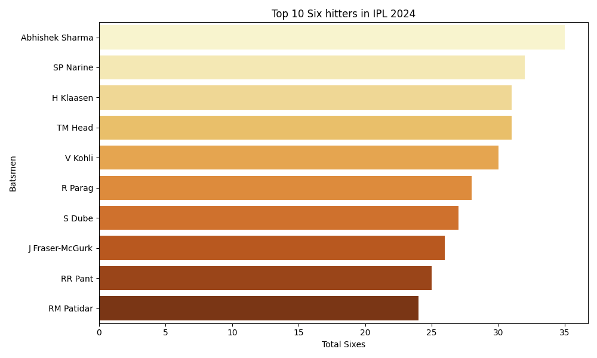

---

### 2. Top Strike Rate Players
**File:** `top_strike_rate_players.png`  
Shows players with the best average strike rate across all matches.

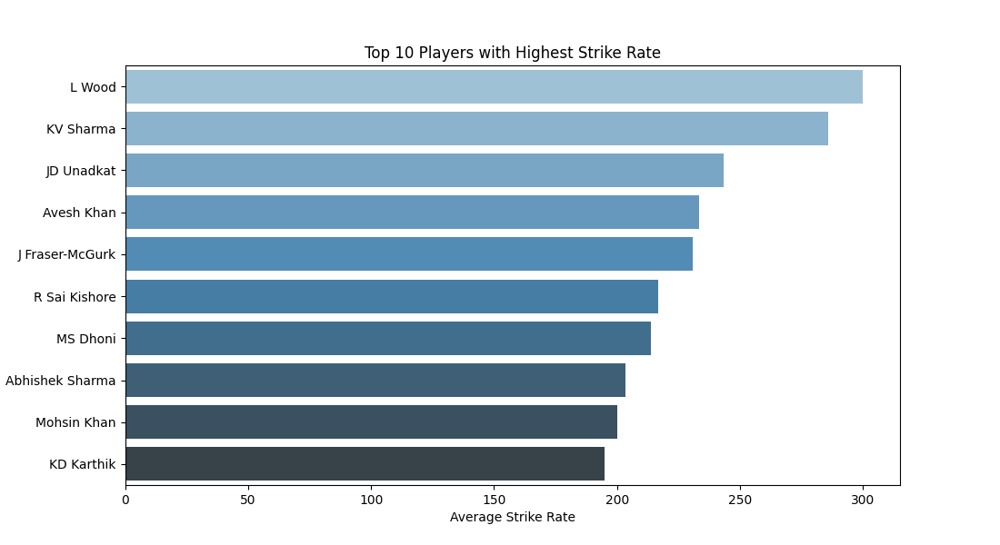

---

### 3. Strike Rate (Runs > 200)
**File:** `top_strike_rate_players_Runs_above_200.png`  
Focuses on players who not only had high strike rates but also scored over 200 runs.


---

### 4. RCB Player Strike Rate
**File:** `rcb_players_strike_rate.png`  
Compares strike rates of top batsmen from Royal Challengers Bangalore.

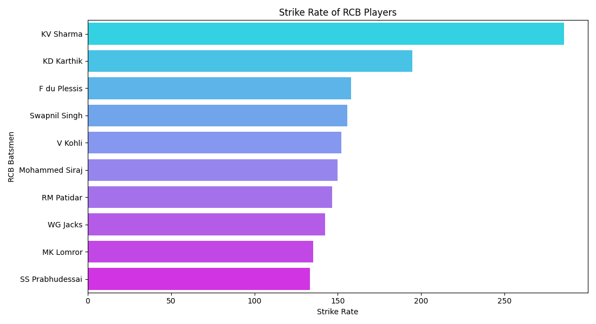

---

### 5. Team Strike Rate Comparison
**File:** `team_strike_rate_comparison.png`  
Highlights the average strike rate achieved by each team.

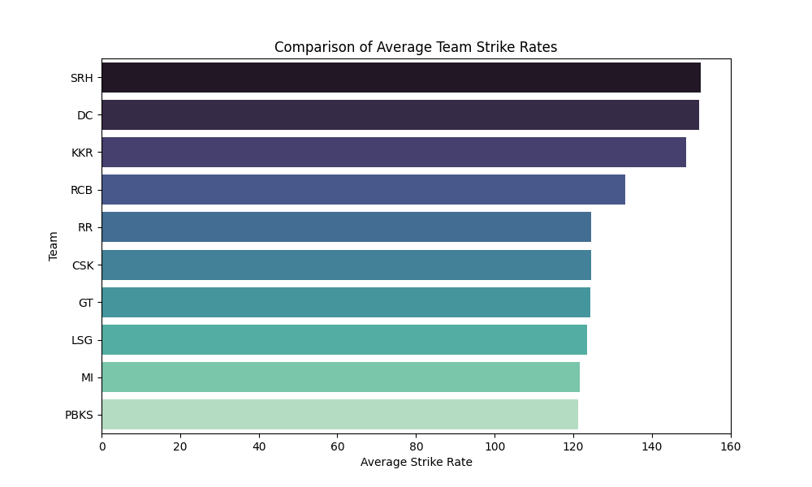

---

### 6. Team Fours and Sixes
**File:** `team_fours_sixes.png`  
Shows total boundaries (4s and 6s) scored by teams during the tournament.

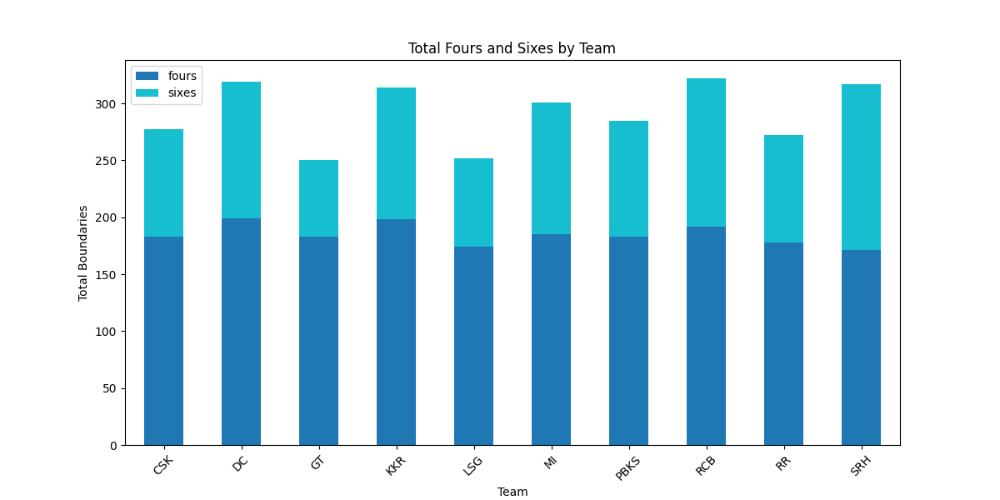

---

### 7. Wickets Lost in Powerplay
**File:** `wickets_lost_powerplay.png`  
Analyzes which teams lost the most wickets within the first 6 overs.

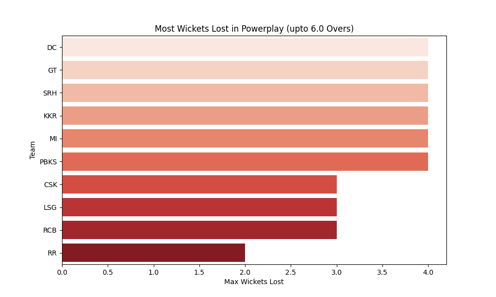

---

### 8. Runs Scored in Powerplay
**File:** `runs_scored_in_powerplay_teamwise.png`  
Displays the teams with highest powerplay scores.

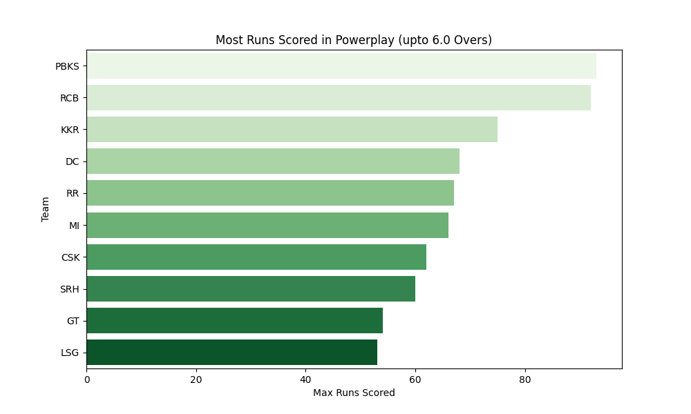

---

### 9. Average Runs by Venue
**File:** `avg_runs_by_venue.png`  
Helps assess pitch conditions by comparing scoring rates across venues.

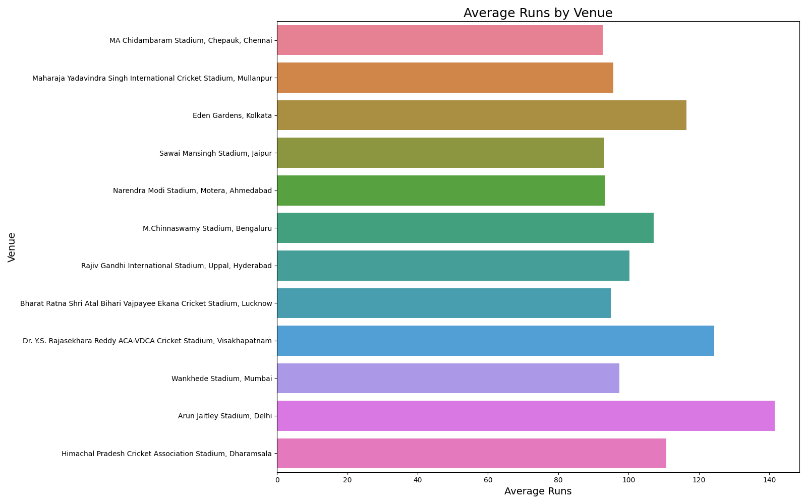

---

### 10. Correlation Heatmap
**File:** `correlation_heatmap.png`  
Illustrates correlation between numeric features like runs, boundaries, etc.

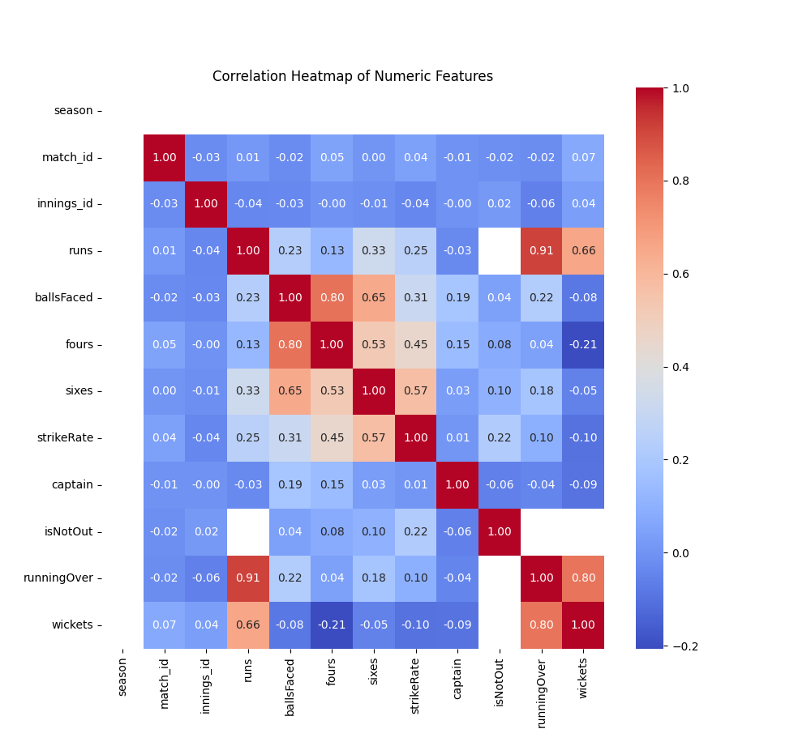

---

### 11. Pairplot of Batting Features
**File:** `pairplot_batting_features.png`  
Explores relationships between runs, balls faced, boundaries, and strike rate.

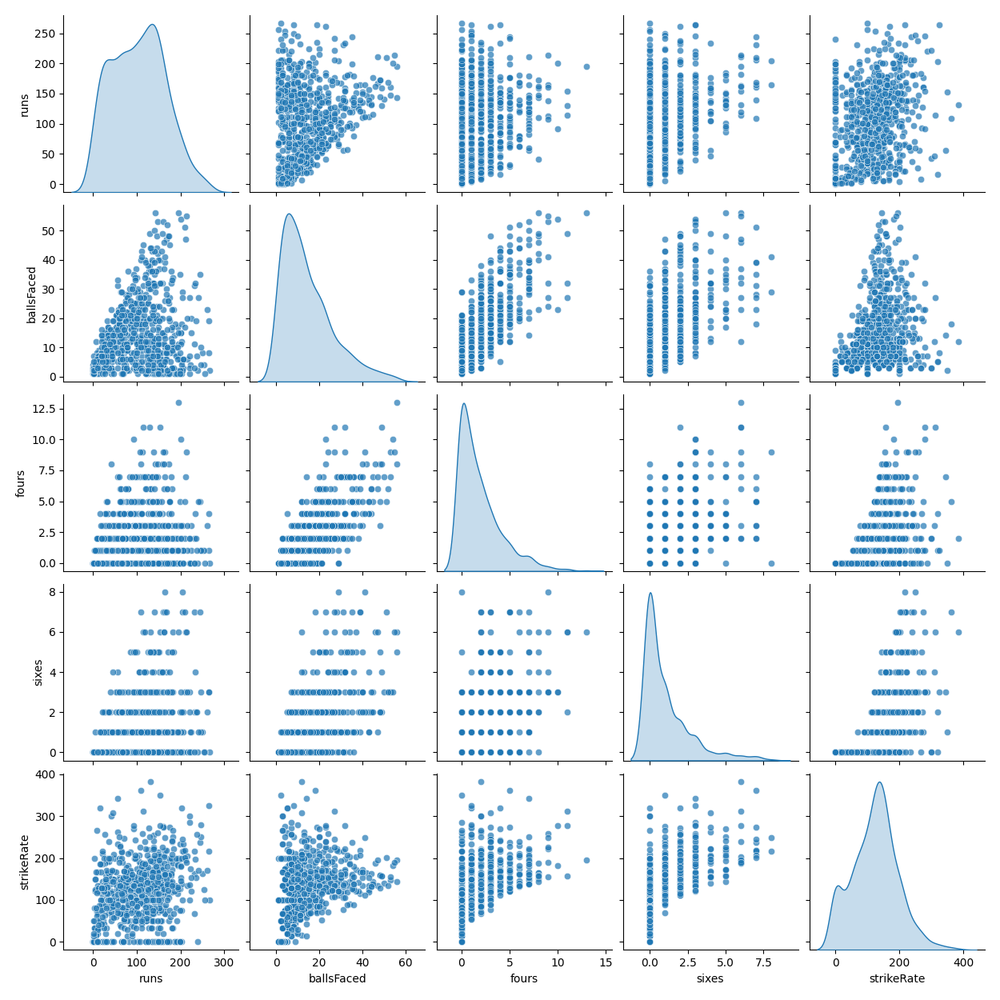

---

### 12. Average Fours and Sixes per Player
**File:** `avg_fours_sixes_per_player.png`  
Top players based on their average boundary count (fours and sixes).

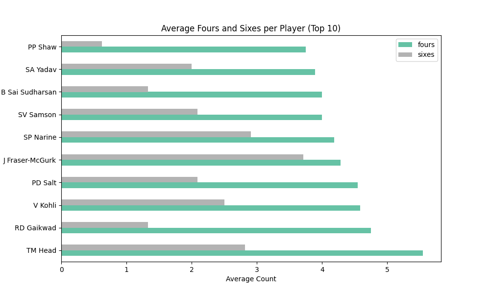

---

### 13. Top 3 Six Hitters Per Team
**File:** `top_Six_hitters_teamwise.png`  
Shows top 3 six hitters in each team based on total sixes.

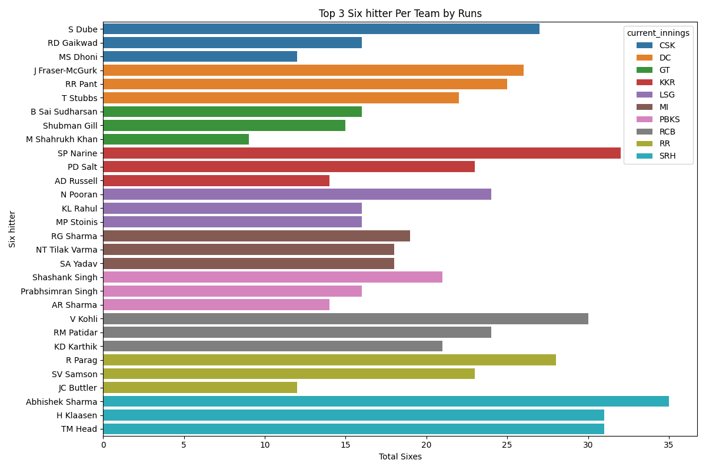

---

## ▶️ Running the Project

### 1. Install Required Libraries
```bash
pip install pandas matplotlib seaborn
```

### 2. Execute the Visualization Script
Navigate to the folder containing `ipl2024_visualizations.py` and run:
```bash
python ipl2024_visualizations.py
```

Ensure `IPL_cleaned_2024.csv` is in the same directory. All outputs will be saved inside the `visualizations/` folder.

---

## 📦 Tech Stack

- Python 3.x
- Jupyter Notebook
- Pandas
- Matplotlib
- Seaborn
- OS & AST libraries (used for file path & JSON parsing)

---

## 🎯 Key Learnings

- How to clean nested and inconsistent real-world cricket data
- Visual storytelling using aggregated metrics
- Efficient use of groupby, filtering, and visualization 

---

## 📬 Credits

- Dataset: [IPL 2024 Dataset on Kaggle](https://www.kaggle.com/datasets/rajsengo/indian-premier-league-ipl-all-seasons)
- Author: **Shubham Sourav**
