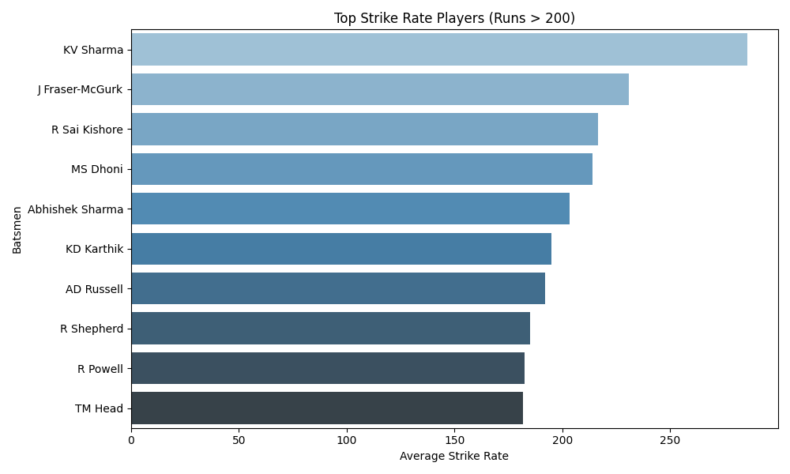

# 🏏 IPL 2024 Dataset – Data Cleaning & Visual Analytics

**Prepared by:** Shubham Sourav  
**Module:** Week 3 – Data Analysis Assignment

---

## 📘 Overview

This project focuses on cleaning, analyzing, and visualizing match-wise performance metrics from the IPL 2024 season. The workflow covers:
- Parsing raw CSV data from Kaggle
- Extracting and formatting nested match fields (e.g., scores, overs)
- Producing a range of insightful visualizations using `matplotlib` and `seaborn`

The objective is to help cricket analysts explore how players and teams performed across multiple dimensions, such as boundary counts, strike rates, venue efficiency, and powerplay metrics.

---

## 📂 Project Structure

```
Assignment/
└── Week 3/
    ├── cleaning_dataset.ipynb
    ├── ipl_2024.csv
    ├── IPL_cleaned_2024.csv
    ├── ipl2024_visualizations.py
    └── visualizations/
```

| File                          | Purpose                                                                |
|-------------------------------|------------------------------------------------------------------------|
| `ipl_2024.csv`                | Raw dataset from Kaggle                                                |
| `cleaning_dataset.ipynb`      | Notebook to clean data and extract structured metrics                  |
| `IPL_cleaned_2024.csv`        | Output dataset after preprocessing                                     |
| `ipl2024_visualizations.py`   | Python script that loads cleaned data and generates plots              |
| `visualizations/`             | Directory that stores all `.png` visual outputs                        |

---

## 🧹 Data Cleaning Pipeline

Executed via `cleaning_dataset.ipynb`, the following tasks were performed:

- Converted `runningScore` JSON strings to dictionaries using `ast.literal_eval`
- Extracted key fields like `runs`, `wickets`, and cleaned `runningOver`
- Handled missing, malformed, or inconsistent entries
- Converted data types for fields like `ballsFaced`, `strikeRate`, and `runningOver`
- Exported final cleaned DataFrame to `IPL_cleaned_2024.csv` for further analysis

---

## 📈 Visualizations Summary

The script `ipl2024_visualizations.py` generates insights categorized below. All charts are saved in the `visualizations/` folder automatically.

---

### 🔹 Batsman-Centric Visuals

**`top_10_Six_hitter.png`**  
Top 10 players with the most sixes  


**`top_strike_rate_players.png`**  
Players with highest average strike rate  


**`top_strike_rate_players_Runs_above_200.png`**  
Best strike rates among players with >200 runs  


**`rcb_players_strike_rate.png`**  
Strike rate comparison within Royal Challengers Bangalore  


---

### 🔹 Team Performance Visuals

**`team_strike_rate_comparison.png`**  
Average strike rate per team  


**`team_fours_sixes.png`**  
Total boundaries (fours + sixes) per team  


**`wickets_lost_powerplay.png`**  
Most wickets lost by teams during powerplay  


**`runs_scored_in_powerplay_teamwise.png`**  
Most runs scored by teams in powerplay overs  


---

### 🔹 Venue & Feature Correlation

**`avg_runs_by_venue.png`**  
Average runs scored across IPL venues  


**`correlation_heatmap.png`**  
Correlation between key numeric features  


**`pairplot_batting_features.png`**  
Pairplot showing relation among runs, boundaries, strike rate  


---

### 🔹 Player Comparisons

**`avg_fours_sixes_per_player.png`**  
Top 10 players by average number of boundaries  


**`top_Six_hitters_teamwise.png`**  
Top 3 six hitters per team  


---

## ▶️ Running the Project

### 1. Install Required Libraries
```bash
pip install pandas matplotlib seaborn
```

### 2. Execute the Visualization Script
Navigate to the folder containing `ipl2024_visualizations.py` and run:
```bash
python ipl2024_visualizations.py
```

Ensure `IPL_cleaned_2024.csv` is in the same directory. All outputs will be saved inside the `visualizations/` folder.

---

## 📦 Tech Stack

- Python 3.x
- Jupyter Notebook
- Pandas
- Matplotlib
- Seaborn
- OS & AST libraries (used for file path & JSON parsing)

---

## 🎯 Key Learnings

- How to clean nested and inconsistent real-world cricket data
- Visual storytelling using aggregated metrics
- Building automated and modular data pipelines
- Efficient use of groupby, filtering, and visualization APIs

---

## 📬 Credits

- Dataset: [IPL 2024 Dataset on Kaggle](https://www.kaggle.com/datasets/rajsengo/indian-premier-league-ipl-all-seasons)
- Author: **Shubham Sourav**
