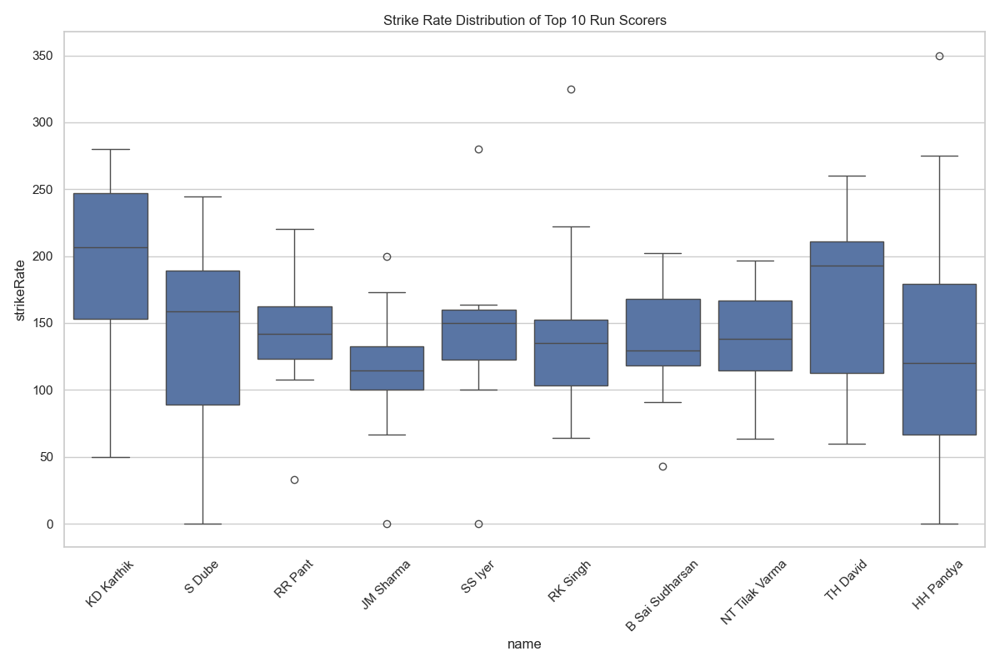
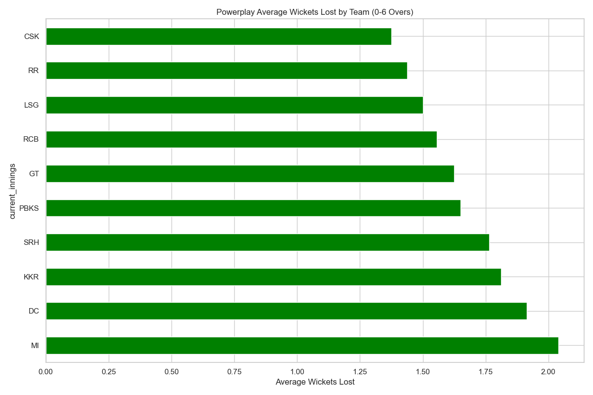

# 🏏 IPL 2024 – Exploratory Data Analysis (EDA)
---

## 📘 Overview

This project performs an in-depth Exploratory Data Analysis (EDA) on the IPL 2024 dataset. The primary goals include:
- Understanding data distributions
- Identifying missing values
- Detecting outliers
- Uncovering relationships between variables
- Visualizing key insights such as boundary statistics, strike rates, and powerplay performances

The insights were generated using Python’s data analysis stack: `pandas`, `matplotlib`, and `seaborn`.

---

## 📁 Project Structure

```
Assignment/
└── Week 4/
    ├── IPL_2024_EDA.ipynb          ✅ Main notebook with full EDA
    ├── IPL_cleaned_2024.csv        ✅ Cleaned IPL 2024 dataset
    ├── ipl_2024_eda.py             (Optional) script to automate plots
    ├── visualizations/             Folder storing output plots/images
    └── README.md                   ✅ This file
```

| File/Folder             | Description                                                  |
|-------------------------|--------------------------------------------------------------|
| `IPL_2024_EDA.ipynb`    | Full notebook containing cleaning, analysis, and plots       |
| `IPL_cleaned_2024.csv`  | Cleaned dataset used for visualizations                      |
| `ipl_2024_eda.py`       | Python script for reproducible EDA visualizations            |
| `visualizations/`       | All generated plots/images saved for quick access            |
| `README.md`             | Project summary, guide, and credit                           |

---

## 📊 Visualizations Summary

### ✅ Top Player & Team Insights

### 1. Top 10 Six Hitters
**File:** `top_10_Six_hitter.png`  
Bar chart showing players with the highest number of sixes.


### 2. Top 10 Four Hitters
**File:** `top_10_four_hitters.png`  
Bar chart showing players with the most fours in the season.


### 3. Strike Rate Distribution of Top 10 Run Scorers
**File:** `strike_rate_dist_top_10_run_scorers.png`  
Boxplot comparing the strike rate variance for top run-getters.



### 4. Powerplay Average Runs by Team (0–6 Overs)
**File:** `powerplay_avg_runs.png`  
Bar chart of maximum runs scored in powerplay overs, by team.


### 4. Powerplay Average Wickets Lost by Team (0–6 Overs)
**File:** `powerplay_avg_wickets.png`  
Bar chart showing team-wise powerplay wicket losses.



---

## 📈 Methodologies Used

- **GroupBy Aggregation**: To compute totals (runs, boundaries, wickets) and averages.
- **Filtering**: For powerplay overs (0–6), top scorers, or boundary hitters.
- **Box Plots & Bar Plots**: To visualize distribution and comparisons.
- **Data Cleaning**: Handling missing values, converting data types.

---

## ▶️ How to Run

### 1. Install Required Libraries
```bash
pip install pandas matplotlib seaborn
```

### 2. Run the Notebook

Open the Jupyter Notebook:

```bash
jupyter notebook IPL_2024_EDA.ipynb
```

Or run the Python script:

```bash
python ipl_2024_eda.py
```

All plots will be saved in the `visualizations/` folder.

---

Ensure `IPL_cleaned_2024.csv` is in the same directory. All outputs will be saved inside the `visualizations/` folder.

---

## 🛠 Tech Stack

- Python 3.x
- Pandas
- Matplotlib
- Seaborn
- Jupyter Notebook


---

## 🎯 Key Learnings

- End-to-End EDA Workflow Mastery
- Insightful Visual Storytelling with Python
- Statistical Thinking in Sports Analytics

---

## 📬 Credits

- Dataset: [IPL 2024 Dataset on Kaggle](https://www.kaggle.com/datasets/rajsengo/indian-premier-league-ipl-all-seasons)
- Author: **Shubham Sourav**

---

## 📚 Project Goal Reminder

> Conduct an in-depth Exploratory Data Analysis on a complex dataset. Focus on understanding data distributions, identifying missing values, detecting outliers, and uncovering relationships between variables. Utilize visualizations like histograms, box plots, and heatmaps to support your findings.

---
