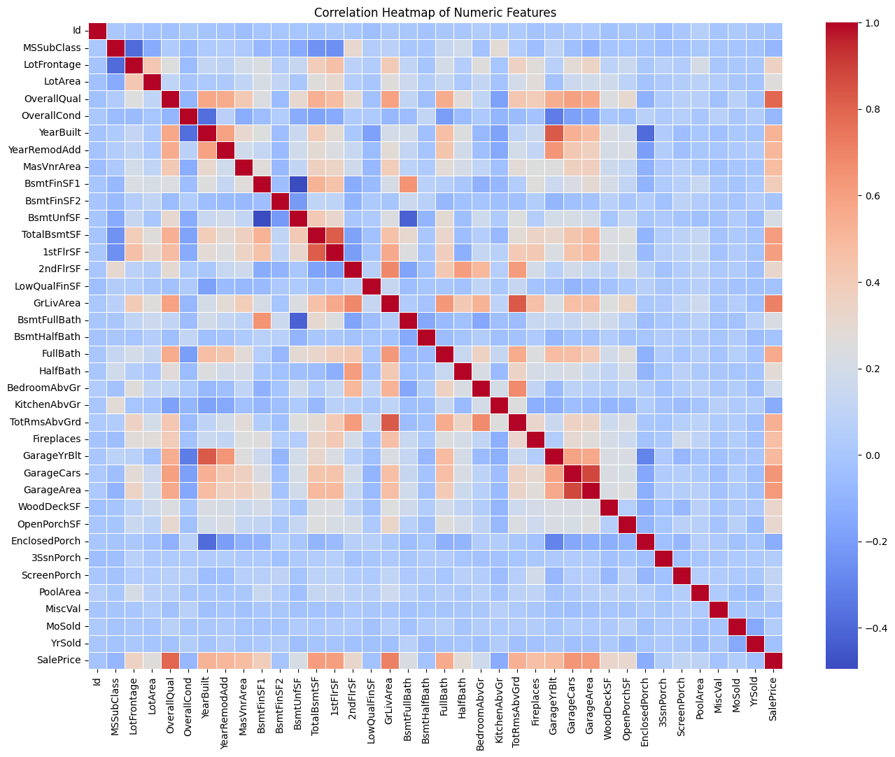
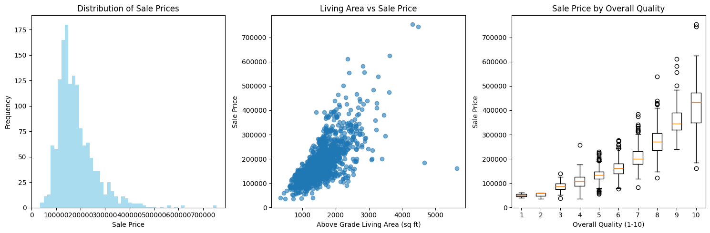
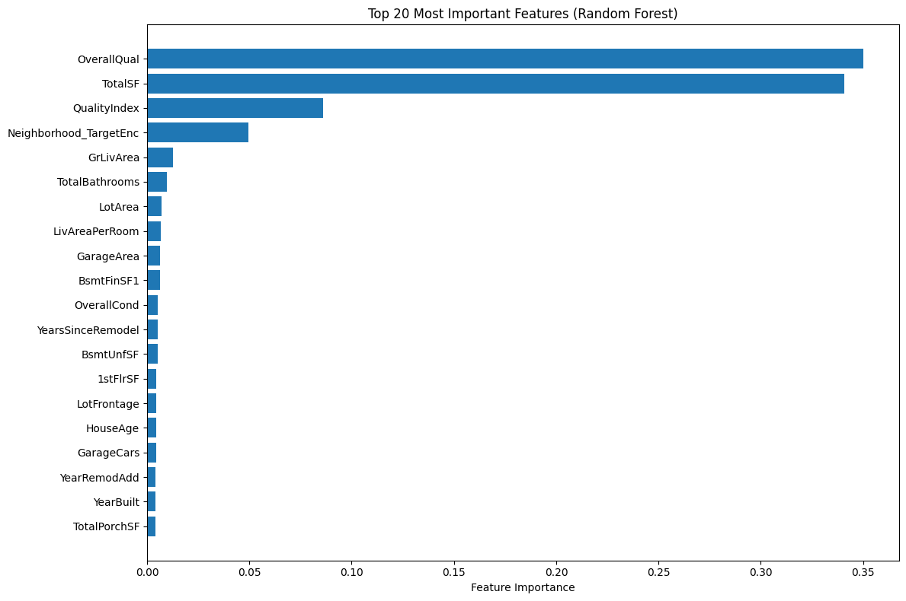

# 🏠 House Price Prediction – Data Preprocessing & Feature Engineering  
---

## 📘 Overview

This project tackles a **machine learning regression problem** using the Ames Housing dataset. The primary goal is to predict the final sale price of homes based on 79 explanatory variables that describe various characteristics of the properties.

The solution demonstrates:
- Effective data cleaning and preprocessing
- Thoughtful feature engineering
- Use of diverse regression models
- Visualization of insights and model results
---

## 📁 Project Structure

```
Assignment/
└── Week 5/
    ├── data/
    │   ├── data_description.txt        ✅ Detailed description of each feature
    │   ├── sample_submission.csv       ✅ Format for expected submission
    │   ├── test.csv                    ✅ Test dataset for prediction
    │   └── train.csv                   ✅ Training dataset with target variable
    │
    ├── house_price_predictions.ipynb   ✅ Main notebook with preprocessing & modeling
    ├── house_price_predictions.csv     ✅ Final predictions generated from the model
    ├── visualizations/                 ✅ Folder storing EDA and feature plots
    ├── requirements.txt                ✅ Required Python packages
    └── README.md                       ✅ This file
```

| File/Folder                  | Description                                                             |
|------------------------------|-------------------------------------------------------------------------|
| `train.csv`                  | Dataset with 79 features and target `SalePrice`                        |
| `test.csv`                   | Test set for which predictions are made                                |
| `data_description.txt`       | Official field/feature descriptions                                    |
| `sample_submission.csv`      | Kaggle format to validate submission structure                         |
| `house_price_predictions.ipynb` | Jupyter notebook with full pipeline: EDA → preprocessing → modeling  |
| `house_price_predictions.csv` | Model predictions ready for submission                                |
| `requirements.txt` | Required Python packages                                |
| `visualizations/`            | Directory for saved charts and plots                                   |

---

## 📊 Dataset Description

- **Source**: [Kaggle - House Prices: Advanced Regression Techniques](https://www.kaggle.com/competitions/house-prices-advanced-regression-techniques/data)
- **Target Variable**: `SalePrice` – the price the house sold for.
- **Features**: 79 features describing various aspects of residential properties, including:
  - Lot size
  - Number of rooms
  - Basement area
  - Garage quality
  - Neighborhood
  - Year built, etc.

---

## 📊 Visualizations Summary

### 1. 🔥 Correlation Heatmap



- Displays pairwise correlation between numeric variables.
- Features like `OverallQual`, `GrLivArea`, and `GarageCars` show strong correlation with `SalePrice`.

---

### 2. 📈 Sale Price Exploration



- **Left**: Distribution of house sale prices shows right skewness.
- **Middle**: Positive linear relationship between `GrLivArea` and `SalePrice`.
- **Right**: Boxplot of `OverallQual` vs `SalePrice` reveals a strong positive trend.

---

### 3. 🧠 Feature Importance (Random Forest)



- Bar plot of top 20 most important features selected by a Random Forest Regressor.
- `OverallQual`, `TotalSF`, and engineered features like `QualityIndex` dominate in predictive power.

---

## 🛠️ Techniques Used

- **Data Preprocessing**:
  - Handling missing values
  - Label encoding and feature scaling
  - Exploratory Data Analysis (EDA)

- **Visualization**:
  - Distribution plots
  - Correlation heatmaps
  - Feature vs. target scatterplots

- **Modeling**:
  - Linear Regression
  - Ridge & Lasso Regression
  - Decision Tree & Random Forest
  - Gradient Boosting
  - KNN & SVR

- **Evaluation Metrics**:
  - RMSE (Root Mean Squared Error)
  - MAE (Mean Absolute Error)
  - R² Score

---

## ▶️ How to Run

### 1. Clone this repo or download the files

```bash
git clone https://github.com/ShubhamS168/Celebal-CSI-Data-Science
cd Assignment/Week 5/
```

### 2. Install all dependencies

```bash
pip install -r requirements.txt
```

### 3. Run the Notebook

```bash
jupyter notebook house_price_predictions.ipynb
```

---

## 🎓 Learning Outcomes

- Practice with advanced regression techniques
- Develop feature engineering strategies
- Learn model evaluation and tuning with cross-validation
- Apply real-world data science pipeline

---

## 📬 Credits

- Dataset: [Kaggle - House Prices: Advanced Regression Techniques](https://www.kaggle.com/competitions/house-prices-advanced-regression-techniques/data)
- Author: **Shubham Sourav**

---

## 📚 Project Goal Reminder

> Predict house prices using structured data involving categorical, numerical, and ordinal features. Emphasize data preprocessing, feature transformation, and advanced regression techniques to build a robust predictive model.

---

## 🙏 Acknowledgments

The Ames Housing dataset was compiled by **Dean De Cock** to support data science education. It provides a modern, rich alternative to the classic Boston Housing dataset.

@misc{house-prices-advanced-regression-techniques,
    author = {Anna Montoya and DataCanary},
    title = {House Prices - Advanced Regression Techniques},
    year = {2016},
    howpublished = {\url{https://kaggle.com/competitions/house-prices-advanced-regression-techniques}},
    note = {Kaggle}
}

---
