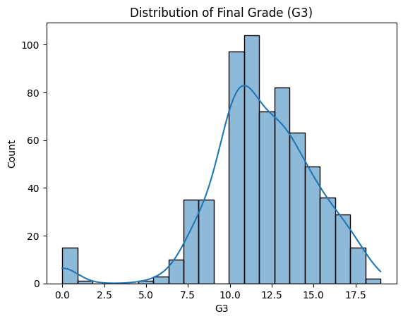
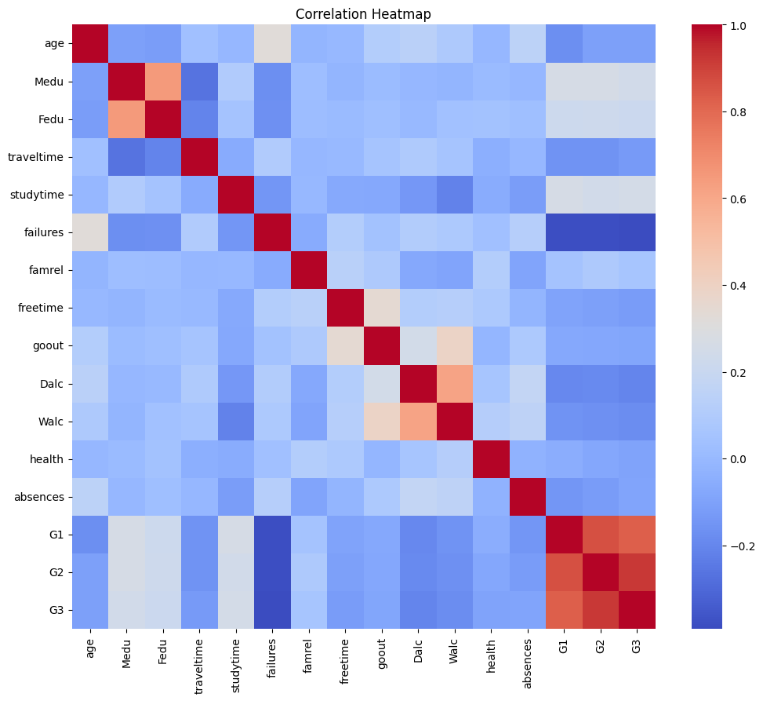
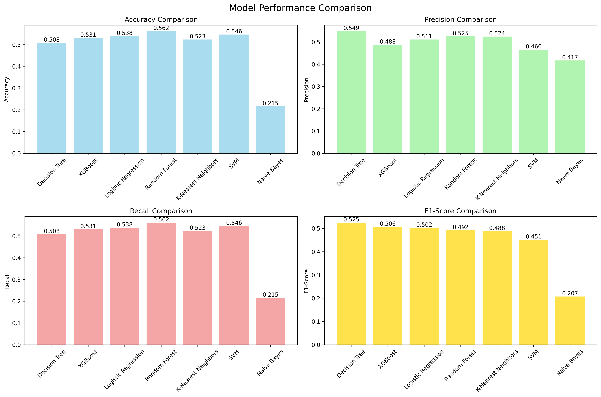
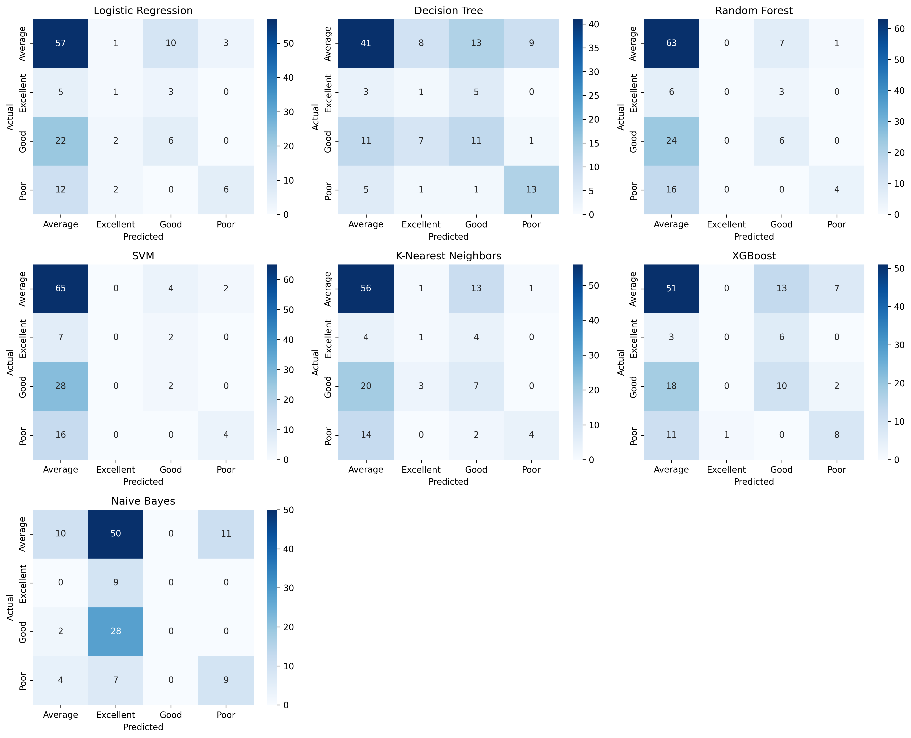

# 📊 Model Evaluation and Hyperparameter Tuning – Student Performance Classification

## 📘 Overview

This project performs a comparative analysis of multiple machine learning models on the Student Performance dataset from UCI. The primary objective is to predict student achievement levels based on demographic, social, and academic features, leveraging advanced model evaluation and hyperparameter tuning techniques.

The solution demonstrates:

- End-to-end data preprocessing and feature engineering.
- Training and evaluation of seven diverse classification models.
- Automated hyperparameter tuning using RandomizedSearchCV.
- Visualization and comparison of model results.
- Modular, production-ready code with comprehensive logging.

## 📁 Project Structure

```

Assignment/
└── Week 6/
   ├── data/
   │   └── student-por.csv                # Raw dataset (Portuguese subject)
   ├── notebooks/
   │   ├── eda.ipynb                      # Exploratory Data Analysis & visualization
   │   └── model_training.ipynb           # Step-by-step model training & evaluation
   ├── outputs/
   │   ├── all_confusion_matrices.png     # Combined confusion matrix plots
   │   ├── best_model.pkl                 # Serialized best-performing model
   │   ├── evaluation_results.csv         # Test set metrics for all models
   │   ├── performance_comparison.png     # Bar chart of model metrics
   │   ├── training_results.csv           # Cross-validation scores
   │   └── tuning_results.csv             # Hyperparameter tuning results
   ├── src/
   │   └── ... (preprocess.py, train.py, etc.)
   ├── main.py                            # CLI entry point for the full pipeline
   ├── ml_pipeline.log                    # Logging output
   ├── requirements.txt                   # Required Python packages
   └── README.md                          # Project documentation (this file)
```

## 📊 Dataset Description

- **Source**: UCI Student Performance Data Set
- **Samples**: 649 students (Portuguese subject)
- **Features**: 30+ demographic, social, and academic attributes
- **Target Variable**: Final grade `G3`, engineered into four performance categories:
  - **Average**: 355
  - **Good**: 148
  - **Poor**: 100
  - **Excellent**: 46

## 📈 Results Summary

The pipeline trains seven models and evaluates them on the test set. The **Decision Tree** model achieved the highest F1-Score.


### Model Performance Comparison

> 📌 **Note**: All models were evaluated on the same test split of 130 samples. F1-Score was chosen as the main comparison metric due to class imbalance.

```
Evaluation results saved to outputs/evaluation_results.csv

============================================================
MODEL PERFORMANCE COMPARISON
============================================================
              Model  Accuracy  Precision   Recall  F1-Score
      Decision Tree  0.507692   0.548849 0.507692  0.524831
            XGBoost  0.530769   0.487562 0.530769  0.506493
Logistic Regression  0.538462   0.511256 0.538462  0.502230
      Random Forest  0.561538   0.525282 0.561538  0.491739
K-Nearest Neighbors  0.523077   0.524422 0.523077  0.487536
                SVM  0.546154   0.466291 0.546154  0.451308
        Naive Bayes  0.215385   0.417205 0.215385  0.206882
```

## 📊 Model Performance Comparison

| Model                 | Accuracy | Precision | Recall  | F1-Score |
|----------------------|----------|-----------|---------|----------|
| Decision Tree        | 0.5077   | 0.5488    | 0.5077  | 0.5248   |
| XGBoost              | 0.5308   | 0.4876    | 0.5308  | 0.5065   |
| Logistic Regression  | 0.5385   | 0.5113    | 0.5385  | 0.5022   |
| Random Forest        | 0.5615   | 0.5253    | 0.5615  | 0.4917   |
| K-Nearest Neighbors  | 0.5231   | 0.5244    | 0.5231  | 0.4875   |
| SVM                  | 0.5462   | 0.4663    | 0.5462  | 0.4513   |
| Naive Bayes          | 0.2154   | 0.4172    | 0.2154  | 0.2069   |

```
Best model: Decision Tree with F1-Score: 0.5248
```

## 📊 Detailed Classification Reports

### Logistic Regression

_Logistic Regression is a linear model suitable for multi-class classification. It's fast, interpretable, and serves as a strong baseline in most classification tasks._

| Class      | Precision | Recall | F1-Score | Support |
|------------|-----------|--------|----------|---------|
| Average    | 0.59      | 0.80   | 0.68     | 71      |
| Excellent  | 0.17      | 0.11   | 0.13     | 9       |
| Good       | 0.32      | 0.20   | 0.24     | 30      |
| Poor       | 0.67      | 0.30   | 0.41     | 20      |
| **Accuracy** |           |        | **0.54** | 130     |
| **Macro avg** | 0.44      | 0.35   | 0.37     | 130     |
| **Weighted avg** | 0.51      | 0.54   | 0.50     | 130     |

### Decision Tree

_The Decision Tree model builds a flowchart-like structure to make decisions. It is easy to interpret and performs well with minimal preprocessing._

| Class      | Precision | Recall | F1-Score | Support |
|------------|-----------|--------|----------|---------|
| Average    | 0.68      | 0.58   | 0.63     | 71      |
| Excellent  | 0.06      | 0.11   | 0.08     | 9       |
| Good       | 0.37      | 0.37   | 0.37     | 30      |
| Poor       | 0.57      | 0.65   | 0.60     | 20      |
| **Accuracy** |           |        | **0.51** | 130     |
| **Macro avg** | 0.42      | 0.43   | 0.42     | 130     |
| **Weighted avg** | 0.55      | 0.51   | 0.52     | 130     |

### Random Forest

_Random Forest is an ensemble technique that combines multiple decision trees to improve predictive performance and reduce overfitting._

| Class      | Precision | Recall | F1-Score | Support |
|------------|-----------|--------|----------|---------|
| Average    | 0.58      | 0.89   | 0.70     | 71      |
| Excellent  | 0.00      | 0.00   | 0.00     | 9       |
| Good       | 0.38      | 0.20   | 0.26     | 30      |
| Poor       | 0.80      | 0.20   | 0.32     | 20      |
| **Accuracy** |           |        | **0.56** | 130     |
| **Macro avg** | 0.44      | 0.32   | 0.32     | 130     |
| **Weighted avg** | 0.53      | 0.56   | 0.49     | 130     |

### SVM

_Support Vector Machine (SVM) is effective in high-dimensional spaces and works well when there is a clear margin of separation between classes._

| Class      | Precision | Recall | F1-Score | Support |
|------------|-----------|--------|----------|---------|
| Average    | 0.56      | 0.92   | 0.70     | 71      |
| Excellent  | 0.00      | 0.00   | 0.00     | 9       |
| Good       | 0.25      | 0.07   | 0.11     | 30      |
| Poor       | 0.67      | 0.20   | 0.31     | 20      |
| **Accuracy** |           |        | **0.55** | 130     |
| **Macro avg** | 0.37      | 0.30   | 0.28     | 130     |
| **Weighted avg** | 0.47      | 0.55   | 0.45     | 130     |

### K-Nearest Neighbors

_K-Nearest Neighbors (KNN) is a simple, instance-based learning algorithm that classifies data based on the most common class among the k closest samples._

| Class      | Precision | Recall | F1-Score | Support |
|------------|-----------|--------|----------|---------|
| Average    | 0.60      | 0.79   | 0.68     | 71      |
| Excellent  | 0.20      | 0.11   | 0.14     | 9       |
| Good       | 0.27      | 0.23   | 0.25     | 30      |
| Poor       | 0.80      | 0.20   | 0.32     | 20      |
| **Accuracy** |           |        | **0.52** | 130     |
| **Macro avg** | 0.47      | 0.33   | 0.35     | 130     |
| **Weighted avg** | 0.52      | 0.52   | 0.49     | 130     |

### XGBoost

_XGBoost is a gradient boosting framework known for its high performance and regularization capabilities, making it a top choice in many ML competitions._

| Class      | Precision | Recall | F1-Score | Support |
|------------|-----------|--------|----------|---------|
| Average    | 0.61      | 0.72   | 0.66     | 71      |
| Excellent  | 0.00      | 0.00   | 0.00     | 9       |
| Good       | 0.34      | 0.33   | 0.34     | 30      |
| Poor       | 0.47      | 0.40   | 0.43     | 20      |
| **Accuracy** |           |        | **0.53** | 130     |
| **Macro avg** | 0.36      | 0.36   | 0.36     | 130     |
| **Weighted avg** | 0.49      | 0.53   | 0.51     | 130     |

### Naive Bayes

_Naive Bayes is a probabilistic model based on Bayes’ theorem with a strong independence assumption, often used for baseline text classification tasks._

| Class      | Precision | Recall | F1-Score | Support |
|------------|-----------|--------|----------|---------|
| Average    | 0.62      | 0.14   | 0.23     | 71      |
| Excellent  | 0.10      | 1.00   | 0.17     | 9       |
| Good       | 0.00      | 0.00   | 0.00     | 30      |
| Poor       | 0.45      | 0.45   | 0.45     | 20      |
| **Accuracy** |           |        | **0.22** | 130     |
| **Macro avg** | 0.29      | 0.40   | 0.21     | 130     |
| **Weighted avg** | 0.42      | 0.22   | 0.21     | 130     |


## 🔧 Hyperparameter Tuning Results

> The search space varied by model. Random Forest and XGBoost showed the most improvement through tuning, whereas Naive Bayes had a very limited parameter space.

| Model\_Method               | Best\_Score | Best\_Params                                                                                                    |
| --------------------------- | ----------- | --------------------------------------------------------------------------------------------------------------- |
| XGBoost\_random             | 0.5380      | {'subsample': 0.9, 'n\_estimators': 50, 'max\_depth': 7, 'learning\_rate': 0.2}                                 |
| Random Forest\_random       | 0.5283      | {'n\_estimators': 50, 'min\_samples\_split': 5, 'min\_samples\_leaf': 1, 'max\_depth': None, 'bootstrap': True} |
| SVM\_random                 | 0.5175      | {'kernel': 'rbf', 'gamma': 0.01, 'C': 10}                                                                       |
| Logistic Regression\_random | 0.5081      | {'solver': 'saga', 'penalty': 'l1', 'max\_iter': 1000, 'C': 100}                                                |
| K-Nearest Neighbors\_random | 0.5014      | {'weights': 'distance', 'n\_neighbors': 7, 'metric': 'manhattan'}                                               |
| Decision Tree\_random       | 0.4886      | {'min\_samples\_split': 5, 'min\_samples\_leaf': 4, 'max\_depth': 10, 'criterion': 'entropy'}                   |
| Naive Bayes\_random         | 0.2049      | {'var\_smoothing': 1e-06}                                                                                       |

## 🖼️ Visualizations


### 📌 1. Exploratory Data Analysis (EDA)

EDA was performed to understand the structure, distribution, and relationships in the data. Two key visualizations include:



- This plot helps visualize how student grades are distributed, including skewness and density.
---


- Displays pairwise correlations between numerical features to identify multicollinearity or strong predictive signals.

---

### 📌 2. Model Training & Evaluation

After training all models, the evaluation phase produced the following visualizations using the Evaluator utility:



- A bar chart to visually compare models across Accuracy, Precision, Recall, and F1-Score.

---



- A grid plot showing confusion matrices side-by-side to evaluate per-class prediction performance for all models.

---

## ▶️ How to Run

### 1. Clone the Repository

```bash
git https://github.com/ShubhamS168/Celebal-CSI-Data-Science
cd Assignment/Week 6/
```

### 2. Install all dependencies

```bash
pip install -r requirements.txt
```

### 3. Run the Full Pipeline

```bash
python main.py
```

### 4. Inspect outputs/

All logs are saved in `ml_pipeline.log`, and visual outputs are saved in the `outputs/` directory.

## 🧩 Pipeline Overview

This machine learning pipeline performs a full-cycle classification workflow, automating preprocessing, training, evaluation, tuning, and result logging. Below is a breakdown of each step:

1. **Data Preprocessing**  
   - Creates and encodes the target label (`G3` ➔ performance category)  
   - Scales numerical features using `StandardScaler`  
   - Splits the dataset into training and test sets

2. **Model Training**  
   - Trains **7 classifiers**:  
     - Logistic Regression  
     - Decision Tree  
     - Random Forest  
     - Support Vector Machine (SVM)  
     - K-Nearest Neighbors (KNN)  
     - XGBoost  
     - Naive Bayes  
   - Uses **5-fold cross-validation** for robust training  
   - Logs mean accuracy and standard deviation

3. **Model Evaluation**  
   - Evaluates models on the **held-out test set**  
   - Calculates **Accuracy**, **Precision**, **Recall**, and **F1-Score**  
   - Generates confusion matrices and bar charts comparing all models  
   - Logs detailed classification reports for each model

4. **Hyperparameter Tuning** (Optional)  
   - Uses `RandomizedSearchCV` (default) or `GridSearchCV`  
   - Tunes top-performing models for optimal performance  
   - Saves best hyperparameters and tuning scores

5. **Model Persistence**  
   - Saves the following serialized models:
     - `best_model.pkl`: Best-performing model on the test set
     - `best_tuned_model.pkl`: Best model after tuning (by CV score)

6. **Output Artifacts**  
   All key results are saved in the `outputs/` directory:
   - `training_results.csv`  
   - `evaluation_results.csv`  
   - `tuning_results.csv`  
   - `performance_comparison.png`  
   - `all_confusion_matrices.png`

## ✅ Pipeline Summary

```
============================================================
PIPELINE SUMMARY
============================================================
Start Time           : 2025-06-29 15:52:58.614937
End Time             : 2025-06-29 15:55:25.956430
Total Duration       : 0:02:27.341493
Output Directory     : outputs
Number of Models     : 7
Best Model           : Random Forest
Best CV Score        : 0.5857
```

The pipeline ran successfully from start to finish, producing a complete suite of results and artifacts for model comparison and selection.

📂 **Generated Output Files** (available in the `outputs/` directory):

- `training_results.csv`: Cross-validation scores for all models
- `evaluation_results.csv`: Performance metrics on the test dataset
- `tuning_results.csv`: Results from RandomizedSearchCV
- `best_model.pkl`: Best-performing model based on test F1-score
- `best_tuned_model.pkl`: Best hyperparameter-tuned model based on cross-validation
- Visual reports:
  - `performance_comparison.png`: Comparative bar chart of model metrics
  - `all_confusion_matrices.png`: Confusion matrices for all models

```
======================================================================
PIPELINE COMPLETED SUCCESSFULLY!
======================================================================
```

---

## 📬 Credits

- Dataset: [Paulo Cortez and Alice Silva, University of Minho](https://archive.ics.uci.edu/dataset/320/student+performance)
- Author: **Shubham Sourav**

---

## 📚 Project Goal Reminder

> Build and compare multiple classification models on student performance data, optimize them using GridSearchCV and RandomizedSearchCV, and select the best-performing model based on evaluation metrics like accuracy, precision, recall, and F1-score.

---